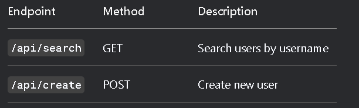

# User Search App

A React Native application with Expo Router that provides real-time user search functionality connected to a Node.js backend.

## Features

- Real-time user search with debouncing
- Clean, modern UI with responsive design
- TypeScript support for type safety
- Expo Router for navigation
- MongoDB backend for data storage
- Custom search hook for reusable logic

## Technologies

**Client:**
- React Native
- Expo Router
- TypeScript
- Axios

**Server:**
- Node.js
- Express
- MongoDB
- Mongoose
- CORS

## Installation

1. **Clone the repository**
   ```bash
   git clone https://github.com/KIRENGA-Remy/Search_functionality.git
   cd Search_functionality

2. **Install dependencies**
# Client
cd frontend
npm install

# Server
cd backend
npm install

3. **Environment Setup**
#Create .env file in backend directory
MONGODB_URL=your_mongodb_connection_string
PORT=4321

4. **Running the App**
#Start the backend server
cd backend
npm run dev

#Start the Expo app
cd frontend
cd client
npx expo start

5. **Project Structure**

search/
├── frontend/ 
    └──client                # React Native client
│      └── app/
│          ├── (auth)/           # Authentication screens
│          ├── (tabs)/           # Tab navigation
│          ├── _layout.tsx       # Root layout
│          └── +not-found.tsx    # 404 page
│          ├── components/       # Shared components
│          ├── hooks/            # Custom hooks
│          └── constants/        # App constants
└── backend/                   # Node.js backend
    ├── src/index.js           # Server entry point
    └── .env                   # Environment variables here

6. **API Endpoints**
Endpoint	  Method	Description
/api/search	  GET	    Search users by username
/api/create	  POST	    Create new user



7. **Contributing**
Fork the project

Create your feature branch (git checkout -b feature/AmazingFeature)

Commit your changes (git commit -m 'Add some AmazingFeature')

Push to the branch (git push origin feature/AmazingFeature)

Open a Pull Request

8. **License**
Distributed under the MIT License. See LICENSE for more information.